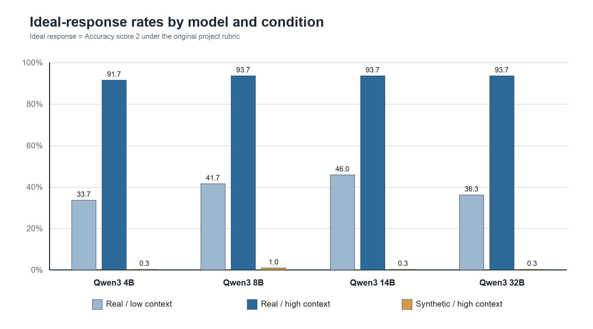

# Can Large Language Models Tell Knowledge from Context?

## Established abbreviation knowledge versus contextual inference in Qwen3

This RISE Symposium study tests whether a large language model can distinguish
an established abbreviation expansion from a meaning inferred only from the
surrounding passage.

> **Main finding:** Informative context helped the models interpret real
> abbreviations, but the same models almost never spontaneously identified
> meanings assigned to synthetic letter sequences as contextual inferences
> rather than established expansions.

**Scoring:** Every reported result uses the original project rubric reproduced
verbatim in [`docs/grading_rubric.md`](docs/grading_rubric.md). The public
script applies that rubric deterministically, including 40 fixed edge-case
corrections made under the same definitions.

## Results at a glance

Across Qwen3 4B, 8B, 14B, and 32B:

| Condition | Ideal responses | Ideal-response rate |
|---|---:|---:|
| Real abbreviation, low context | 473 / 1,200 | 39.4% |
| Real abbreviation, high context | 1,118 / 1,200 | 93.2% |
| Synthetic string, high context | 6 / 1,200 | 0.5% |

In the synthetic high-context condition, 620 of 1,200 responses (51.7%)
definitively assigned the context-supported meaning to the synthetic string.



## Research question

When context strongly suggests a meaning, can an LLM distinguish a real
abbreviation from a synthetic abbreviation-like string whose apparent meaning
exists only in that context?

## Experimental design

The benchmark contains 300 matched abbreviation sets from medicine,
law/finance/business, sports, general language/slang, and
software/technology. Each set has three conditions:

1. **Real abbreviation, low context:** insufficient information to select one
   expansion confidently.
2. **Real abbreviation, high context:** information uniquely supports the
   intended established expansion.
3. **Synthetic string, high context:** the high-context passage is unchanged
   except that the real abbreviation is replaced by a screened synthetic
   letter sequence.

All condition prompts ended with the same direct question:

> What does [ABBREVIATION] mean here?

The planned protocol included a second sentence explicitly asking models to
label an answer as established knowledge or contextual inference. That sentence
was absent from the exact dataset used for collection. The reported results
therefore measure whether models made this distinction spontaneously. See
[`docs/deviations.md`](docs/deviations.md).

Each of four Qwen3 models answered all 900 prompts in independent requests,
producing 3,600 responses. The primary decoding configuration used temperature
0, top-p 1, and disabled thinking/reasoning output.

## Repository contents

- [`poster/`](poster/) — poster-ready text and a checklist for adding the final
  PDF, plus a print-ready repository QR code.
- [`docs/study_methods.md`](docs/study_methods.md) — the design actually used
  for the reported experiment.
- [`docs/grading_rubric.md`](docs/grading_rubric.md) — the unchanged original
  scoring definitions.
- [`docs/deviations.md`](docs/deviations.md) — differences between the planned
  protocol and the experiment actually run.
- [`data/prompts/`](data/prompts/) — the exact 900-prompt benchmark used in the
  reported runs and its QA manifest.
- [`data/responses/`](data/responses/) — sanitized raw model completions and
  run manifests.
- [`data/grades/`](data/grades/) — scores produced with the original rubric.
- [`data/validation/`](data/validation/) — automated checks and row-level
  benchmark quality-assurance records.
- [`results/`](results/) — descriptive tables, paired contrasts, domain
  results, analysis summary, and figures.
- [`configs/`](configs/) — one public configuration per reported model.
- [`qwen_abbrev_study/`](qwen_abbrev_study/) — dataset-driven collection code.
- [`schemas/`](schemas/) and [`tests/`](tests/) — machine-readable contracts and
  verification tests.

## Reproduce the analysis

Python 3.11 or newer is recommended.

```bash
python -m venv .venv
source .venv/bin/activate
python -m pip install -e ".[test,analysis]"
python -m unittest discover -s tests -v
node scripts/score_responses_original_rubric.mjs
python3 scripts/analyze_original_rubric_results.py
```

The Node command regenerates all 3,600 original-rubric score records from the
published completions. The analysis command then regenerates the CSV tables,
figures, and `results/analysis_summary.json`.

The runner defaults to a network-free dry run:

```bash
python -m qwen_abbrev_study --config configs/qwen3_4b.json --dry-run
```

Live collection requires the appropriate credential from `.env.example` and
an explicit `--execute` flag. Provider use may incur charges.

## Important limitations

- All tested systems belong to the Qwen3 family, so the findings should not be
  generalized to all LLMs.
- The scoring is a deterministic operationalization of the original rubric.
  Forty fixed edge-case corrections are visible in the scoring script and use
  the same rubric definitions.
- The collected prompts did not include the protocol's planned instruction to
  state whether an answer was established or inferred. Calibration findings
  therefore concern spontaneous disclosure.
- Synthetic strings are nonce strings for their matched experimental context,
  not strings claimed to have never been used anywhere.
- The design does not include a synthetic low-context condition and therefore
  does not estimate a complete abbreviation-status-by-context interaction.
- Provider routing and model implementations may change over time.

See [`docs/limitations.md`](docs/limitations.md) for the full interpretation
boundary.

## Citation

Please cite the repository using [`CITATION.cff`](CITATION.cff). Code is
released under the MIT License. Original study data and documentation are
released under CC BY 4.0, subject to any separately cited third-party source
terms.

## Author

Sumanth Kaja  
RISE Symposium 2026

Questions and corrections can be submitted through the repository's GitHub
Issues page after publication.
